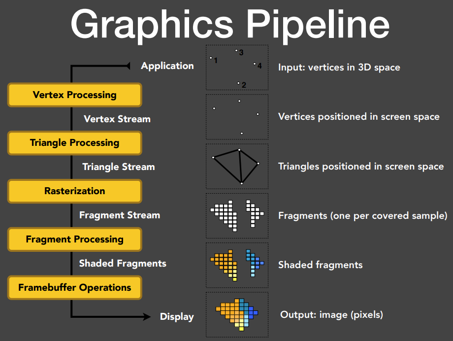

# CG基础概述

## 1 渲染管线 Graphics Pipeline

<figure markdown>
  { width="67%" }
  <figcaption>渲染管线 Graphics Pipeline</figcaption>
</figure>

## 2 OpenGL

**OpenGL** 是一系列从 CPU 调用 GPU 管线的 API 集合，其是跨平台的

等位替代：DirectX, Vulkan, etc.

OpenGL 的工作流：

1）Place objects/models 放置模型

定义 Vertex buffer object (VBO)，其中包括物体的顶点、法线、纹理等信息，然后交给 GPU。在 OpenGL 中已经定义好了一些可以直接调用的特定的矩阵，不需要再自己额外定义

2）Set up an easel 放置画架

视图变换: 放置相机，并直接调用视图变换的相关函数和矩阵即可 (e.g. gluPerspective)

创建并使用 framebuffer帧缓存

3）Attach a canvas to the easel 放置画布

OpenGL 中一个 Rendering Pass 的工作：对于**一次**场景渲染，可以利用**一个 ​**framebuffer 一次性输出**多个**不同的纹理（着色 shading，深度 depth 等），然后由片元着色器决定每一张纹理具体的使用

4）Paint to the canvas 画至画布上

使用顶点着色器和片元着色器实现：

1. OpenGL 调用用户定义的顶点着色器进行各种顶点变换（模型变换、观察变换等）以及其他相关操作
2. OpenGL 内部将每一个三角形打成一个个片元（像素）
3. OpenGL 调用用户定义的片元着色器进行光照计算和着色等操作。并且 OpenGL 会自动处理深度测试 z-buffer depth，除非用户进行覆写

总结：在每一个 Pass 中：

1. Specify objects, camera, MVP, etc.
2. Specify framebuffer and input/output textures
3. Specify vertex/fragment shaders
4. (When you have everything specified on the GPU) Render!

在以上的基础上，可以用多次 Pass 进行多次渲染完成一些特殊的操作

## 3 OpenGL Shading Language (GLSL)

**Shading Language**：定义顶点着色器和片元着色器的着色语言。而着色语言最终还是要编译为汇编语言才能交给GPU进行处理

GLSL (OpenGL), HLSL (DirectX), CG (NVIDIA) 都是着色语言

## 4 渲染方程 The Rendering Equation

渲染方程是渲染中最重要的方程，用于描述光线的传播：

<figure>渲染方程 Rendering Equation</figure>

而在实时渲染 real-time rendering (RTR) 中，**可见性Visibility ​**经常需要加入显式考虑因素中，并且 BRDF 往往和 cosine 一起考虑：

<figure>加入 可见性项V 的渲染方程</figure>

在实时渲染中，对于全局光照 = 直接光照 + 间接光照中的间接光照只处理 **One-bounce 一次**间接反射