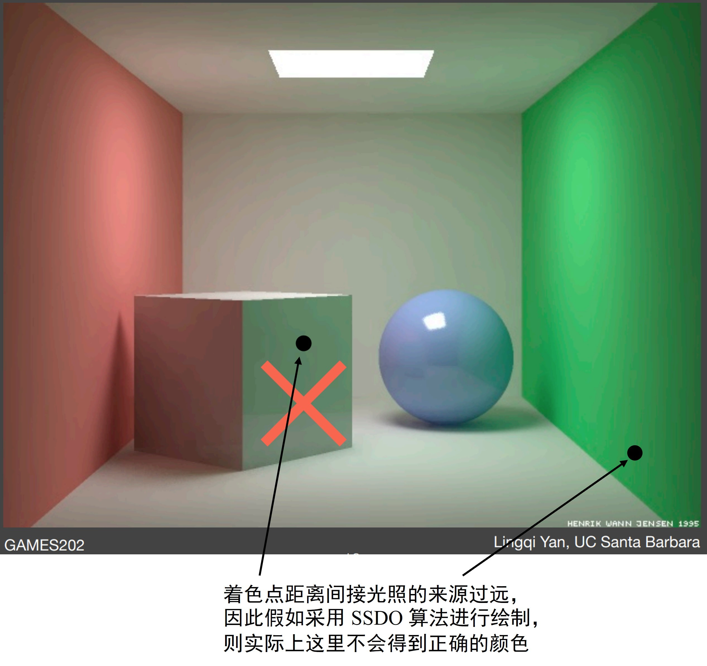
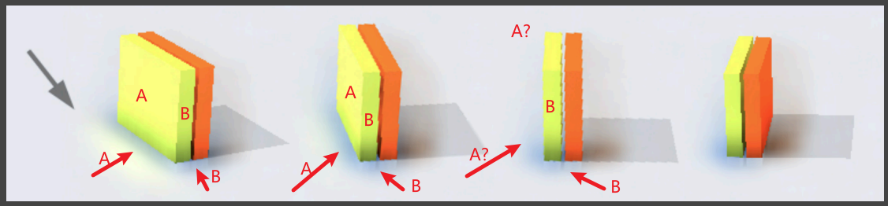
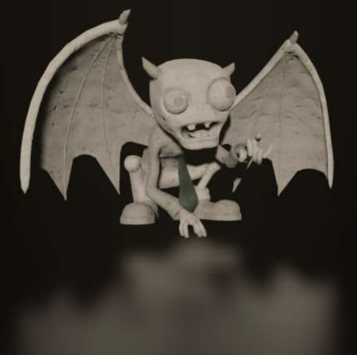
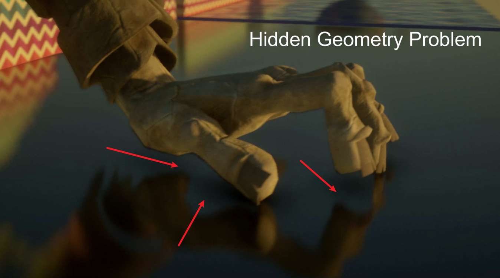
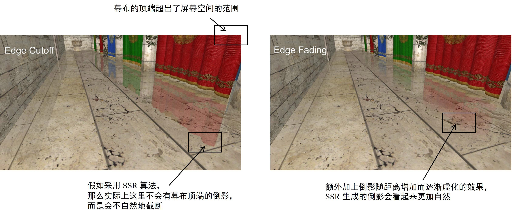
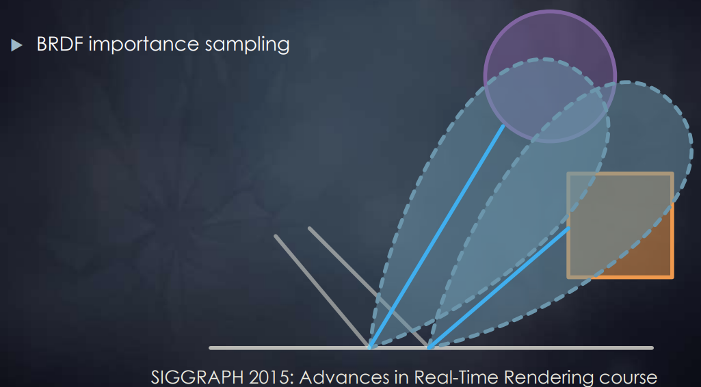
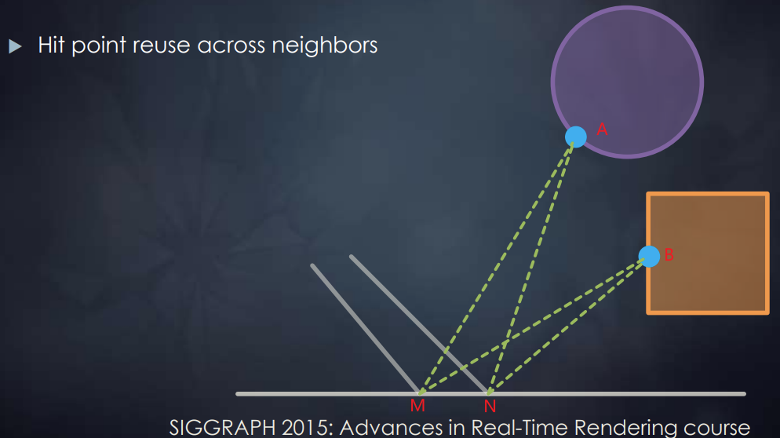
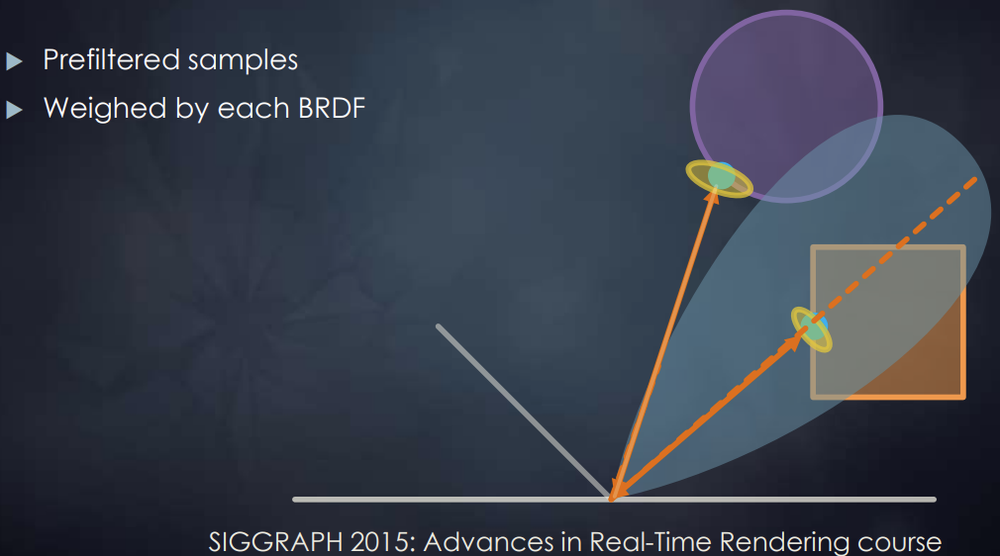

# 五 实时全局光照 Real-Time Global Illumination

> 本课程为闫令琪老师的 [GAMES202-高质量实时渲染](https://sites.cs.ucsb.edu/~lingqi/teaching/games202.html)
>
> 此为个人的课堂笔记，如有疏漏，请多指正

**全局光照明 Global Illumination (GI)**：指场景光源在景物表面产生的全部光照效果，包含了直接光照和间接光照效果。在绘制真实感图形时，全局光照十分重要，但又相当复杂

例如下面这张渲染图展示了全局光照需要处理的大部分类型的光照信息：

<div align=center>

<figcaption>实时全局光照</figcaption>
</div>

在实时渲染 RTR 中，综合考虑实现的质量和速度，全局光照通常只考虑**直接光照效果**和在景物表面之间**散射一次的间接光照效果**：

<div align=center>

<figcaption>散射一次的间接光照</figcaption>
</div>

而对于这个**散射一次的间接光照**的理解，以上图为例，P点 并不关心到达它的光线究竟是直接光还是散射一次的间接光，P点 统一处理所有抵达它的光照信息。因此对于 Q点 来说，直接将 Q点 这种接收直接光照并将其散射照亮其他物体的点**考虑为一个光源**进行处理，称为**次级光源 Secondary Lightsource**

可以通过下面这张对比图来感受一次间接光散射带来的效果，其中被直接光照到的墙面、地面都作为次级光源进行处理：

<div align=center>

<figcaption>无间接光照和散射一次的间接光照对比</figcaption>
</div>

因此，以这种“次级光源”的思想进行理解，对于每一个 着色点P，实现其间接光照着色需要处理的关键点在于：

1. 寻找被直接光源照亮而成为次级光源的物体表面
2. 计算作为次级光源的物体表面对着色点间接光照的贡献


根据算法主要在哪个空间中处理信息，可以将计算全局光照的算法分为以下三大类：

1. 图像空间算法：在生成直接光照效果时，算法会从**光源视角**生成的深度图。如果全局光照算法在生成间接光照效果时，除了用到从**相机视角**得到的信息之外，也用到了深度图信息，但是**没有用到从其它视角得到的场景三维信息**，即该算法只用到了图像空间 (image space) 的信息，则这该算法属于图像空间算法。包括 RSM 算法
2. 世界空间算法：如果全局光照算法在生成间接光照效果时，除了用到从**相机视角**和**光源视角**得到的图像空间信息之外，还**用到了从其它的场景三维信息**，即该算法使用了世界空间的信息，则这该算法属于世界空间算法。包括 LPV 算法、VXGI 算法
3. 屏幕空间算法：如果全局光照算法在生成间接光照效果时，**只根据从相机视角**能得到的信息，对只有直接光照的渲染结果进行**后处理 (post processing) ​**以加上间接光照效果，即只用到了屏幕空间 (screen space) 信息，则这该算法属于屏幕空间算法。包括 SSAO 算法、SSDO 算法、SSR 算法（可以理解为屏幕空间算法的间接光照是“猜出来”的，而不是像图像空间算法和世界空间算法真的去实际计算）


在正式进入实时全局光照的算法介绍之前，有一些前置知识需要了解：

1. **辐射度量学 Radiometry**：详细内容参考 **GAMES101-光线追踪（辐射度量学）**


## 1 反射阴影图 Reflective Shadow Maps (RSM)

**RSM** 是一种基于阴影图 (Shadow Map) 的实时全局光照算法，它利用了阴影图来保存次级光源的相关信息，从而实现对于间接光照的计算

以下主要从 RSM 算法如何解决之前提到的实现间接光照的两个关键点展开：

### 1）RSM 算法寻找次级光源

关于如何“寻找被直接光源照亮而成为次级光源的物体表面”，阴影图 Shadow Map 本身就解决了这个问题，因为深度图记录了场景中的每一个像素是否被光源直接照亮，这些被光源直接照亮的像素就是次级光源


### 2）RSM 算法计算次级光源对着色点间接光照的贡献

#### （1）假设次级光源是漫反射 Diffuse 材质

当“计算作为次级光源的物体表面对着色点间接光照的贡献”时，如果每一个作为次级光源的面片 patch（假设为 点Q）都要考虑所有可能被它照亮的着色点（假设为很多个 点P），那么从 点Q 到每一个 点P 都是一个不同的光线的出射方向 $\omega_o$，都需要根据这个出射方向计算一次渲染方程得到这个方向上的光照信息，这个计算量是十分庞大的。为了避免由于**出射方向** $\omega_o$ **不定**导致的庞大计算量，RSM 算法中将次级光源材质假定为**漫反射 Diffuse ​**的，这样渲染方程的 BRDF项 就是一个和出射方向 $\omega_o$ 无关的常数（需要注意的是，这里是假设**次级光源 Q点 是 Diffuse ​**的，而对于 着色点P 并没有这个假设）

#### （2）次级光源Q 照亮 着色点P 的渲染方程的推导

计算 着色点P 的间接光照的原始渲染方程如下：

$$
L_o(p,\omega_o)=\int_{\Omega_{patch}}L_i(p,\omega_i)f_r(p,\omega_i,\omega_o)cos\theta_i V(\omega_i) \mathrm{d}\omega_i
$$

对于光线入射方向 $\omega_i$ 的积分 $\mathrm{d}\omega_i$，也就是对于单位立体角的积分，可以根据立体角的定义 {立体角的球面度 $\Omega$ = 球面积 $A $ / 半径的平方 $r^2$}，得到如下等式：

<div align=center>

<figcaption>单位立体角的积分</figcaption>
</div>

将该等式代入到原渲染方程中，可以得到如下渲染方程，得到一个对于 面积$A$ 的定积分（注意，如果 $cos\theta$ 的计算过程没有进行归一化，下面除的 p、q 之间的距离的平方需要变成四次方来对两个 $ cos\theta$ 的计算归一化）：

$$
L_o^{indir}(p,\omega_o)=\int_{A_{patch}}L_i(q\to p)V(p,\omega_i)f_r(p,q\to p,\omega_o)\frac{cos\theta_p cos\theta_q}{||q-p||^2}\mathrm{d}A
$$

其中，$L_i(q \rightarrow p)$ 是 Q点 到 P点 的辐射亮度 Radiance，$V(p, ω_i)$是 P点 对于 Q点 的可见度， $f_r(p,q \rightarrow p, \omega_o)$ 是 P点 的 BRDF项

对于 $L_i(q \rightarrow p)$ 项：

由于之前已经假设了 Q点 是一个**漫反射 Diffuse ​**材质，因此在计算 Q点 的渲染方程时的 BRDF项 $f_r(q, \omega_i',\omega_i)$（$\omega_i'$ 是直接光源照向 Q点 的入射方向，$\omega_i$ 既是 P点 的光线入射方向，也是 Q点 的光线出射方向）时其就和 $\omega_i'$、$\omega_i$ 无关的一个常数 $f_r(q, \omega_i',\omega_i)=\rho_q/\pi$

根据 BRDF 的定义，**出射光的辐射亮度 Radiance = 入射光的辐射照度 Irradiance * BRDF项**，因此$ L_i(q→p) = 入射光的辐射照度 Irradiance \cdot f_r(q,ω_i',ω_i)$。而根据辐射照度 Irradiance 的定义，其可以被表示为**单位面积内的电磁辐射的辐射通量**，即辐射照度 Irradiance $E(x) = \frac{\mathrm{d}\Phi(x)} {\mathrm{d}A}$，其中 $\Phi$ 是辐射通量。将其代入，可以将该项写成如下形式

$$
L_i(q\to p)=f_r\cdot \frac{\Phi}{\mathrm{d}A}=\frac{\rho}{\pi}\cdot \frac{\Phi}{\mathrm{d}A}
$$

对于 $V(p, ω_i)$ 项：由于实际上不可能计算每一个可能的着色点 P点 对于所有次级光源 Q点 的可见度，因此直接假设 P、Q 之间可见，将该项默认为1

因此，将上述各式代入原始对于 着色点P 的间接光照的渲染方程，可以得到如下化简效果：

$$
\begin{align}
L_o^{indir}(p,\omega_o)=&\int_{A_{patch}}L_i(q\to p)V(p,\omega_i)f_r(p,q\to p,\omega_o)\frac{cos\theta_p cos\theta_q}{||q-p||^2}\mathrm{d}A
\\
=&\int_{A_{patch}}(\frac{\rho_q}{\pi}\cdot \frac{\Phi_q}{\mathrm{d}A})f_r(p,q\to p,\omega_o)\frac{cos\theta_p cos\theta_q}{||q-p||^2}\mathrm{d}A
\\
=&\sum_q\left[ f_r(p,q\to p,\omega_o) \cdot \Phi_q' \cdot \frac{cos\theta_p cos\theta_q}{||q-p||^2}\right]
\end{align}
$$

其中，$\Phi_q'=\frac{\rho_q}{\pi} \cdot \Phi_q$，是 q 处反射直接光照的辐射通量

因此，RSM 算法在执行时，Shadow Map 中在存储深度值 depth 的同时，还需要额外存储一些数据，以满足上述公式的计算，包括**世界空间坐标 world space coordinate**、**法线方向 normal**、Q点 **反射的直接光照的辐射通量 flux ​**等信息：

<div align=center>

<figcaption>RSM 第一个 Pass 存储的贴图信息</figcaption>
</div>


### 3）RSM 算法思想的额外优化

即使经过以上化简，使用 RSM 算法求取每一个小面片P的间接光照仍然代价高昂：一个512 × 512的 Shadow Map，对于每一个 着色点P，共有26万余个可能作为次级光源的 小面片Q 需要进行计算，因此需要进行进一步优化

对于有些情况的 P点 和 Q点 的组合，根本不需要经过 RSM 算法的计算：

1. P点 和 Q点 之间的明显不可见（但对于复杂场景来说，这个判断仍然很难处理）
2. 当 PQ 的连线和 P点 的法线垂直时，Q点 就根本不会对 P点 的 patch 做任何贡献
3. 当 P点 和 Q点 距离很远时，RSM 算法计算出的结果特别小，近乎可以忽略不计

对于上述优化的第三点，只需要计算**距离 P点 一定范围内的 Q点 ​**作为次级光源的贡献。而想要判定 P点 周围有哪些可用的次级光源 Q点，可以直接在 Shadow Map 上近似：看 P点 和 Q点 在 Shadow Map 上的投影之间的距离。如果**投影点之间距离**比较小，就近似认为 P点 和 Q点 在**世界空间内的实际距离**比较小。不过，即使框选了一定的范围，计算所有可能 Q点 仍然不现实，因此需要使用抽样。具体的采样方法可以参考 PCSS 的第一步和第三步中的采样方法，例如泊松圆盘采样。工业界对此的采样方法为：将深度图中距离着色点更远的像素（对间接光照的贡献小）赋予更小的抽样概率密度，但是赋予更大的抽样权重；距离着色点更近的像素（对间接光照的贡献大）赋予更大的抽样概率密度，但是赋予更小的抽样权重：

<div align=center>

<figcaption>RSM 的采样方法</figcaption>
</div>


### 4）RSM 算法的优缺点

RSM 算法的优势：

1. 通过以上 RSM 算法计算间接光照可以得到比较好的全局光照效果，特别是对于手电筒光线这种比较单一局部的直接光照，画面呈现的间接光照效果十分清晰
2. 算法的代码十分容易实现

<div align=center>

<figcaption>RSM 算法的间接光照效果</figcaption>
</div>

RSM 算法的缺陷：

1. Shadow Map 的所有缺陷，例如当光源数量变多，就需要生成更多的对应数量的 Shadow Map，计算量增大
2. 没有计算 着色点P 和 次级光源Q 之间的可见性，可能造成不真实的情况
3. 进行了很多假设，包括次级光源材质是 Diffuse 的、将 Shadow Map 上的距离假定为三维空间的实际距离
4. 采样数量的多少影响计算的速度和计算结果的质量


## 2 光照传播体积 Light Propagation Volumes (LPV)

计算间接光照的渲染方程时，关键目标是**获取从所有方向入射的间接光线的辐射亮度 Radiance**

在 RSM 中是通过在 Shadow Map 中进行抽样，计算一部分次级光源对着色点P的间接光照来拟合其接收到的所有辐射亮度 Radiance

**Light Propagation Volumes (LPV) ​**算法解决这个问题的主要思想是：根据“光线在沿直线传播的过程中其辐射亮度Radiance不会发生改变”这一物理事实，LPV 算法首先将一个 3D 场景划分为一个个的**三维网格块**（体素 Voxel），然后在网格块内传播来自次级光源的辐射亮度 Radiance，来拟合**辐射亮度场** (Radiance Field)。最后可以直接利用每个网格块中记录的辐射亮度 Radiance 信息，得到处于该网格中的着色点P所接收到的从所有方向入射的间接光线的辐射亮度 Radiance


### 1）LPV 的具体实现过程

LPV 的具体实现过程分为以下4步：

1. 生成场景中的所有次级光源 Generation of radiance point set scene representation
2. 注入初始辐射亮度到三维网格块中 Injection of point cloud of virtual light sources into radiance volume
3. 模拟传播所有辐射亮度 Volumetric radiance propagation
4. 根据最终的辐射亮度进行渲染 Scene lighting with final light propagation volume

在每一帧都要实时完成以上四个步骤


#### （1）生成场景中的所有次级光源

直接使用 RSM 算法中的方法寻找次级光源，也即利用 Shadow Map 的深度信息获得次级光源

可以进行一些抽样操作来减少次级光源的数量

#### （2）注入初始辐射亮度到三维网格块中

预先将场景划分为一个个三维网格块（可以使用三维纹理实现），然后根据从 Shadow Map 的信息中获得的次级光源将每一个网格块中的所有次级光源的辐射亮度 Radiance 算出来并**累加**

累加的结果的辐射亮度 Radiance 是一个二维球面函数，可以利用 PRT 算法里提及的**球谐函数来对其进行压缩**，并且实际应用中仅需前2阶的 SH基函数 就可以基本拟合

<div align=center>

<figcaption>注入初始辐射亮度到三维网格块中</figcaption>
</div>

注：

1. 虽然算法并没有限定次级光源的材质，但是这里只用低阶 SH基函数 进行拟合，高频信息都会丢失，因此实际上仍然是将次级光源假定为**漫反射 Diffuse ​**材质
2. 这里三维网格块的划分大小一般是让其个数比像素数少一个数量级

#### （3）模拟传播所有辐射亮度

对于每一个网格块的辐射亮度 Radiance，其是一个向四面八方辐射的量，因此计算其**向周围六个面辐射的量**，并传递到对应的相邻网格块中并叠加上去

<div align=center>

<figcaption>模拟传播辐射亮度 Radiance</figcaption>
</div>

这个向周围六个面的传递过程可以通过以下一个二维的从左边格子传递到右边格子的情况进行理解：首先将体素格子中心的辐射率传播到右边格子的 3 个非临接面上（即不包括直接相接的那个面，换到三维情况下就是 5 个面）

<div align=center>

<figcaption>辐射亮度的单面传播例子</figcaption>
</div>

从 p 点辐射到表面 f 的辐射通量为 $\Phi_f=\Delta_f/(4\pi )\cdot I(\omega_c)$，其中 $\Delta_f$ 为表面 f 投影到以 p 为中心的立体角值（可以预先计算得到），$\omega_c$ 是立体角的中心方向，$I(\omega_c)$ 是点 p 向 $\omega_c$ 方向发射的辐射率值。然后由表面 f 再向 q 点发射的辐射率则为 $\Phi_f/\pi$。再将其展开成球面谐波权重系数，将这些权重系数加到 q 点存储的权重系数上，从而完成了一个面的传播过程

所有格子的这个传播与累加的过程迭代数次（实际应用中一般为4~5次）得到一个比较稳定的结果后，就得到了每一个网格块的最终辐射亮度 Radiance

注：LPV 算法同样**不考虑次级光源和着色点之间的可见性**问题，这样才能完成这一步模拟传播辐射亮度

#### （4）根据最终的辐射亮度进行渲染

对于任一着色点，寻找其所处的网格块，根据该网格块中存放的定向辐射亮度分布进行着色


### 2）LPV 算法的缺陷

**漏光现象 Light Leaking**：如果划分的网格块较大，对于一些特别小或薄的物体（物体粒度小于网格块粒度），由于该算法会认为每一个网格块中的辐射亮度 Radiance 是均匀分布的，会造成从物体正面注入的辐射亮度可能会照亮本不该被照亮的物体背面

<div align=center>

<figcaption>LPV 算法的问题</figcaption>
</div>

<div align=center>

<figcaption>漏光现象 Light Leaking</figcaption>
</div>

而如果想要尽量避免这种漏光现象，划分的网格块就需要足够小，会导致计算量增大，速度变慢


## 3 体素全局光照 Voxel Global Illumination (VXGI)

**Voxel Global Illumination (VXGI) ​**会比 RSM 和 LPV 的实现效果更佳，但是对应的速度也更慢

VXGI 算法的主要思想是：利用两趟 Pass，首先预先把整个场景离散化为体素 (voxel)，并以稀疏八叉树 (sparse) 的形式组织起来，得到层次化的数据结构；然后类似于离线渲染中的光子图映射 (photon mapping)，对于每一个着色点，根据其材质情况向场景中抛射光子 (photon)（向一个锥体方向进行cone tracing），得到对该着色点有贡献的体素，再进行着色计算


### 1）VXGI 的具体实现过程

VXGI首先需要对整个场景进行体素化，其借用了光栅化的渲染机制，将场景物体分别在 x、y 和 z 轴三个方向上投影绘制三次。这个体素化的具体过程可以参考这篇博客：[体素化Voxelization：基于GPU的三维体素化 | YangWC&apos;s Blog](http://yangwc.com/2019/06/11/Voxelization/)

VXGI会创建一些3D纹理，场景体素化之后会将场景物体的颜色值、法线向量、自发光信息、阴影遮挡信息、粗糙度等存储到这些3D纹理中。需要注意的是，在体素化时，有可能不同的三角形面片会被体素化到同一个体素格子，因此体素格子的属性信息是所有落在这个体素内的三角形属性的平均值

具体的实现过程分为以下两个 Pass：

#### （1）VXGI 的 Pass1：Light Pass

根据直接光照获得每个 patch 的光照信息，然后对于划分的每一个体素将其内部所有 patch 的信息叠加起来，得到这个体素的**入射辐射亮度分布**和**表面法线分布**，然后将这些信息存储在一个稀疏八叉树最底层的叶节点中。然后在稀疏八叉树中自底向上，对于每个非叶节点，通过对子节点存放的信息施加滤波，得到稀疏八叉树中更高层节点存放的入射辐射亮度分布和表面法线分布； 于是，八叉树的**每一层**是一个**对次级光源信息不同粒度的近似**

<div align=center>

<figcaption>VXGI 的 Light Pass</figcaption>
</div>

上图的 Step1 和 2 对应于 Pass1，Step3 对应于下面的 Pass2

其实上述这个八叉树的每一层可以理解为对 3D 体素纹理进行了一个 MipMap 处理：

<div align=center>

<figcaption>体素的 MipMap</figcaption>
</div>

#### （2）VXGI 的 Pass2：Camera Pass

分为两种情况：

对于着色点是 Glossy 的情况，只需要对理想的镜面反射方向进行1个锥体的 cone tracing，找到和这个锥体相交的体素并计算它们对该着色点的贡献之和。考虑到距离着色点越远的体素的可能贡献越小，正好 cone tracing 的锥体覆盖范围也越来越大，利用在 Pass1 中构建的稀疏八叉树找到其对应的粒度层级获取信息（距离越远的粒度越大，得到的信息越不精确），这样利用稀疏八叉树的结构极大减少了计算的开销（八叉树版 MipMap 原理）

<div align=center>

<figcaption>VXGI 的 Glossy Case</figcaption>
</div>

这里的这个 cone tracing 的圆锥体也并不是真正意义上的圆锥体，而是由不同level的体素拼接而成的类锥体的形状，如下图所示，从近到远，体素的大小逐渐增大：

<div align=center>

<figcaption>Cone Tracing</figcaption>
</div>

记 tracing 的圆锥体起始点为 $C_o$、方向为 $C_d$、圆锥体的角度为 $\theta$、当前追踪的长度为 $t$，那么可以用以下的公式计算出当前的 ray marching 点所在体素的边长:

$$
d=2t \cdot tan(\frac{\theta}{2})
$$

而后可以通过 $d$ 计算出需要在哪个 level 的体素 Mipmap 上进行采样：

$$
level=log_2(\frac{d}{V_{size}})
$$

其中，$V_{size}$ 是 Mipmap 最高 level 的大小（即最粗糙层级的 Mipmap 边长）

对于着色点是 Diffuse 的情况，就需要对多个锥体进行 cone tracing（但考虑到效率问题，一般也就5到8个）

<div align=center>

<figcaption>VXGI 的 Diffuse Case</figcaption>
</div>

注：在锥体追踪的过程中，可以通过考虑体素的遮挡影响，将次级光源和着色点之间的可见性考虑进入渲染计算


### 2）VXGI 和 RSM、LPV 的区别

1. VXGI 算法在执行前需要把景物都离散化为**体素**来表示，这和 LPV 算法细分场景得到的**三维网格**有所不同。LPV 的格网单元和景物本身没有特别的对应关系，但是 VXGI 的体素和物体本身是有关的（需要记录**入射辐射亮度分布**和**表面法线分布**），于是，VXGI 算法涉及的场景体素化需要比 LPV 消耗更多的资源。将一个场景体素化可能相当麻烦，这限制了 VXGI 算法的应用
2. LPV 算法是通过拟合的辐射亮度场**间接**进行计算，而 VXGI 算法的思想更接近 RSM，是对次级光源影响着色点的**直接**计算
3. 之前提到的 RSM 和 LPV 都将次级光源的材质认为是漫反射 Diffuse 的，前者是因计算量庞大而主观假定，后者是因球谐函数拟合导致高频信息丢失。但是 VXGI 并没有这个限制，次级光源的材质**可以是 Glossy ​**的，其信息被记录在体素的入射辐射亮度分布和表面法线分布中
4. RSM 算法在计算次级光源对着色点的影响时，没有考虑两者之间的可见性，LPV 算法的辐射亮度场拟合也假定了两者之间都是可见的；而 VXGI 算法则在锥体追踪的过程中，通过考虑体素的遮挡影响，**考虑了次级光源和着色点之间的可见性**


## 4 屏幕空间环境光遮蔽 Screen Space Ambient Occlusion (SSAO)

**Screen Space Ambient Occlusion (SSAO) ​**是一种在屏幕空间中对全局光照的近似。其可以大大地增强场景的光影层次感，使得渲染出来的效果更具三维立体感

<div align=center>

<figcaption>SSAO 的效果</figcaption>
</div>

SSAO 算法的主要思想是：在不知道环境的间接光照的情况下，1）直接假定**间接光照恒定为一个常数**（类似于 Blinn-Phong 光照模型的假设），并且2）假定物体表面是**漫反射 Diffuse ​**材质，但是2）需要**考虑每个着色点的不同方向的可见性**

<div align=center>

<figcaption>SSAO 考虑着色点不同方向的可见性</figcaption>
</div>


### 1）SSAO 算法的渲染方程推导

在进行渲染方程的推导之前，对于 GAMES101 中的**辐射度量学**中提及的“**辐射度量学之前的数学基础**”进行一个补充：**投影立体角 Projected Solid Angle**

立体角 Soild Angle 的值是$球面积A / 半径的平方r^2$，对单位立体角积分可以得到整个球的立体角为 4π 球面度

而如果对立体角乘上一个 $cos\theta$ 项得到的就是投影立体角，对单位投影立体角积分得到的就是**圆的面积 π**

<div align=center>

<figcaption>投影立体角 Projected Solid Angle</figcaption>
</div>


对于原始的渲染方程：

$$
L_o^{indir}(p,\omega_o)=\int_{\Omega^+}L_i(p,\omega_i)f_r(p,\omega_i,\omega_o)V(p,\omega_i)cos\theta_id\omega_i
$$

第一步：根据“实时阴影-2 阴影映射技术背后的数学”中提及的用于估算定积分的经典的近似不等式，可以将 可见性项V 拆解到定积分外面；同时，根据之前提及的对单位投影立体角积分的结果，可以将此处的 $cos\theta·\mathrm{d}\omega_i$ 视为一个整体，原先对整个球的积分就变成了对圆的积分。拆解的结果如下：

<div align=center>

</div>

其中蓝框部分 ****​~**​ ​**~其实就是对**所有方向 可见性V 的一个加权平均**

第二步：对于黄框部分，由于 SSAO 假定物体表面是漫反射 Diffuse 材质，因此 BRDF项 是一个常数 $\rho/\pi$；由于间接光照被恒定为一个常数，因此 光照项L 是一个常数 $L_i^{indir}(p)$，然后渲染方程便可以化简为：

$$
L^{indir}_o(p,\omega_o)
\approx \frac{\rho}{\pi} \cdot L_i(p,\omega_i) \cdot \int_{\Omega^+}V(p,\omega_i)cos\theta_id\omega_i
$$

此外，正是由于上面两个值都是常值，之前对于 可见性项V 的拆解就完全不会影响定积分的结果

注：可以发现，即使不进行第一步对 可见性项V 的拆解，直接对原始的渲染方程进行第二步将两个常值从积分中提出来就可以得到最终的化简结果。但是为了准确得到并理解 $k_A$项**​ ​**这个对 可见性V 的加权平均，就进行了如上的第一步这个额外一步拆解


### 2）SSAO 算法的实际应用过程

对于 可见性项V 的加权平均 $k_A$项：

* 如果是在世界空间下，可以直接使用光线追踪技术（包括近似的模拟实现比如 VXGI）来获得每一个着色点的可见性的加权平均值，但是这种基于真是物理情况的方式需要大量的计算，耗时很长
* 而如果是在屏幕空间下（例如此处的 SSAO），则是在一个后处理过程中以很简单的假定模拟实现的，完全不考虑实际的物理准确性和场景复杂度


#### （1）SSAO 计算 $k_A$项 的主要思想

对于任意一个着色点，想要判定一个半球方向内对其的可见性，需要对这个半球的半径进行限制，而不能考虑无限远的地方（否则对于一个很小的封闭空间，其可见性一定为0）。不过限制了半径就一定会有一些原先可见的点被忽略

<div align=center>

<figcaption>SSAO 判断可见性的主要思想</figcaption>
</div>

SSAO 算法计算 $k_A$项 的主要思想（假设）是：以着色点为中心、有限范围的球体内部随机抽样顶点，根据这些顶点是否能够被着色点看见（抽样点是在物体内部还是物体外部）来估算着色点的可见性

<div align=center>

<figcaption>SSAO 算法计算 k_A项</figcaption>
</div>


#### （2）SSAO 计算 $k_A$项 的实际实现方式

由于在屏幕空间下并不能实际知道抽样点和着色点之间的可见性情况（抽样点是在物体内部还是物体外部），SSAO 是通过**深度缓冲器 (z-buffer) ​**判断这些顶点从**相机**是否可见来假设抽样点对着色点的可见性的（即通过**深度图**近似地判断每个点是在物体内部还是外部，点的深度比深度图上记录的最小深度更深就假设为是在物体内部，则对于着色点是不可见的）。不过上述这种实现方式就会出现上面那张图中被红色虚线框起来的那个采样点的错误估计情况

* 上述用整个球采样的方式其实是有问题的，应该只拿法线方向所在的半球进行采样。但由于 SSAO 算法提出的时代还没办法记录每个着色点的法线信息，工业界提出的替代方案是：只有当顶点样本超过一半不可见，才考虑应用 SSAO，应用时将总抽样数除以2。例如上图的左图，不应用 SSAO；中间图应用 SSAO，计算结果为3/(10/2)，实际是3/5，二者相等；右图应用 SSAO，计算结果为1/(10/2)，实际是1/4，二者约等

* 另外，正是由于没有法线方向，也没办法计算 $cos\theta$，计算 $k_A$项 时没有余弦加权，实际结果并不准确，但是仍可以得到可行的结果


### 3）SSAO 算法的缺陷

1. 深度缓冲器 (z-buffer) 只是对场景几何信息的大概估计，利用这个估计判断实际的几何情况可能不准，生成一些本不该存在的阴影。例如下图的石凳和地板之间就生成了不该存在的阴影
2. 存在所有涉及抽样的算法都会有的问题：抽样少则不准，抽样多速度就慢。工业界对此的解决方案是先用少抽样得到一个高噪音的结果，然后再进行额外一次降噪

<div align=center>

<figcaption>SSAO 算法产生不存在的阴影</figcaption>
</div>

<div align=center>

<figcaption>SSAO 算法的额外降噪处理</figcaption>
</div>


### 4）SSAO 算法的优化：HBAO

随着技术的发展，当可以存储每个着色点的法线信息时，将其代入 SSAO 替代原先进行的近似假设，得到更为准确的结果

<div align=center>

<figcaption>SSAO 和 HBAO 效果比较</figcaption>
</div>


## 5 屏幕空间方向遮蔽 Screen Space Directional Occlusion (SSDO)

### 1）SSDO 的主要思想以及和 SSAO 的区别点

在 SSAO 中是假设间接光照是一个从着色点**周围球体中的所有可见点**的位置发送过来的一个**常量值**，这种方法完全放弃考虑了从其他作为次级光源的 patch 的反射，这就造成了 SSAO 的间接光照效果只是对着色点**原始颜色的明暗处理**，而并**不能将周围物体的颜色**反映出来。SSDO 则解决了这个问题。例如下面这个例子的左下角两张图的对比：

<div align=center>

<figcaption>SSAO 和 SSDO 的效果比较</figcaption>
</div>

SSDO 的主要思想十分类似于光线追踪，其和 SSAO 对于**间接光照的来源**考虑是完全相反的。对于着色点P向周围发出的球体范围的 path tracing，SSAO 将其中的**不被物体挡住的抽样点**（不在物体内部的点）作为可见点来计算一个常量间接光的亮度；而 SSDO 则是就将这些**被挡住的抽样点**作为可见的次级光源来其贡献的间接光照，那些不被挡住的点则**归属于直接光照**的部分处理，不参与间接光照的计算。很明显，相较于 SSAO，SSDO 的思想更符合之前所说的图像空间 (RSM) 和世界空间的算法 (LPV、VXGI)：

<div align=center>

<figcaption>SSAO 和 SSDO 核心思想的区别</figcaption>
</div>

这样，对于 SSDO，其根据 path tracing 得到的可见性V的结果，渲染方程分为直接光照和间接光照两个独立的部分进行计算：

$$
\begin{align}
L_o^{dir}(p,\omega_o)=&\int_{\Omega^+\ V=1}L_i^{dir}(p,\omega_i)f_r(p,\omega_i,\omega_o)cos\theta_i d\omega_i\\
L_o^{indir}(p,\omega_o)=&\int_{\Omega^+\ V=0}L_i^{indir}(p,\omega_i)f_r(p,\omega_i,\omega_o)cos\theta_id\omega_i
\end{align}
$$


### 2）SSDO 算法的实际应用过程

1. 第一步和 SSAO 类似，对上半球进行采样（此时技术力已经支持法线信息的存储），然后根据深度缓冲 z-buffer 中记录的结果近似地判断该点对于着色点P是否可见。如下面的左图，其中的 A、B、D点 不可见，C点 可见
2. 第二步便和 SSAO 背道而驰，更接近于 RSM 算法的思想，对于不可见点，根据 z-buffer 的信息获得其**对应的物体表面的那个点**，然后计算这个表面点作为次级光源时对于 P点 着色的贡献；而像 C点 这种可见点，直接对 PC连接方向 计算环境光的直接光照

<div align=center>

<figcaption>SSDO 算法的应用过程</figcaption>
</div>

SSDO 算法也会产生和 SSAO 类似的错误，例如上面的右图A点作为可见点被处理成了不可见点，B点 在 PB方向 没有直接光源照射的情况下进行了直接光照的计算


### 3）SSDO 算法的缺陷

1. 由于其和 SSAO 类似的抽样机制，只能计算小范围的间接光照，对于距离远但是强度大的间接光照无能为力。例如下图正方体上的着色点若使用 SSAO 则没办法反映出绿色墙壁反射的间接光照信息（图中是其它算法，能够反映出来）
    {:width="33%"}
2. SS 的通病：由于 屏幕空间SS 的信息有限有限，对于那些没办法从屏幕空间看见的表面，它们的信息缺失，没办法为其实现间接光照效果。例如下图的第三张图所反映的间接光照效果，就只有正对摄像机的 B面 的，没有被遮挡住的 A面 的（在 A面 可见时，SSDO 实现的效果还是很好的，就像第一、二张图）
    {:width="50%"}


## 6 屏幕空间反射 Screen Space Reflection (SSR)

**Screen Space Reflection (SSR) ​**是一种**在屏幕空间模拟光线追踪**实现间接光照的算法，因此 SSR 其实更应该理解为屏幕空间光线追踪 Screen Space Ray Tracing，其在屏幕空间上做光线步进 (Ray Marching) 来找到光线与场景的交点。找到交点之后，根据交点的法线、顶点、反照率等得到交点处的直接光照辐射率，以此作为弹射的间接光照辐射率，从而实现间接光照。相较于 SSAO 的远处光线靠假设近处光线信息缺失、SSDO 的远处光线信息缺失，SSR 由于进行了光线追踪，不论近处还是远处的光照信息都不会缺失

在屏幕空间中模拟光线追踪的前提在于：在绝大多数情况下，屏幕空间内的某个像素点的间接光照的次级光源来源基本也都在当前的屏幕空间下（也正是因为这个假设，SSR 算法会有一些缺陷，后面会提及），例如下图白框部分的间接光照的次级光源基本来自于红框部分

<div align=center>

<figcaption>屏幕空间反射</figcaption>
</div>


### 1）SSR 算法的实现流程

首先以一个着色点材质为镜面 Specular 的情况为例，此时只考虑一根光线的光线追踪：

<div align=center>

<figcaption>SSR 的 Specular Case</figcaption>
</div>

根据**法线信息**和**深度信息**，可以计算知道 着色点P 的镜面反射方向上的这根光线打到屏幕空间中的哪一个次级光源 点Q，然后根据 Q点 的着色信息计算其对 P点 的贡献

而对于非 Specular 的材质，则需要将**一根光线追踪**变为对**一个锥体方向的光线追踪**，并叠加所有次级光源的贡献

问题在于，如何对光线进行追踪来确定这根光线究竟打在屏幕空间的哪个点上，也即光线步进 Ray Marching 时的**步长**如何确定。对于这个会显著影响速度的棘手问题，SSR 算法是利用的二维空间下的**深度图像金字塔 image pyramids**，即 **深度MipMap ​**来进行加速处理的，可以快速过滤掉那些不可能相交的点。其基本思想类似于三维空间下的 BVH（Bounding Volume Hierarchies 层次包围盒）或者 KD-tree


SSR 算法的具体实现流程如下：

1. 生成 深度MipMap
2. 基于 深度MipMap 的层次化光线追踪
3. 根据追踪到的次级光源对着色点进行渲染

#### （1）生成 深度MipMap

此处在深度图上进行的 MipMap 操作并不是求平均，而是取该范围内的**最小值**。因为取最小值的操作可以保证如下的一个保守逻辑：如果光线对于一个大的上层结点完全不会相交，那么该光线对于其任意一个子节点都不会相交（可以理解为光线比整个区域的最小值的深度都要浅，那么肯定比该区域的所有地方都要浅）

#### （2）基于 深度MipMap 的层次化光线追踪

有了 深度MipMap 后，对于光线步进 Ray Marching 时的步长就可以利用一种“试探”的方法来取值，从而快速过滤不可能相交的点，这种“试探”的方法十分类似于 TCP拥塞控制 中的慢开始（前期以指数形式增长）+拥塞避免（一旦发生拥堵就将阈值减半）。一个具体的“试探”得到光线交点的过程如下：

<div align=center>

<figcaption>基于 深度MipMap 的层次化光线追踪</figcaption>
</div>

注：上述绿色方块部分是闫令琪老师额外加上去的，但是考虑到生成 MipMap 时这个绿色块中的两个子节点并不会分配到同一个 Level 下，这里的表示可能有一点问题，但是不影响这个算法的理解

上述过程用伪代码表示如下（这里的 level 是 MipMap 的 level，其值可以理解为步长的指数）：

```undefined
mip = 0;
while (level > -1)
    step through current cell;
    if (above Z plane) ++level;
    if (below Z plane) --level;
```

另外，由于生成 深度MipMap 时是2的k次方，对于光线起点在奇数位的，就没办法准确进行上述过程，而是会发生一定的偏移，或者需要一些额外计算

#### （3）根据追踪到的次级光源对着色点进行渲染

对于已经获得的 次级光源Q，由于在屏幕空间中只能获得 Q点 接收到直接光照后**向当前摄像机方向**反射的光线信息，而不能获得其实际向**​ 着色点P点 ​**反射的光线信息，因此只能将 Q点 假定为**漫反射 Diffuse ​**材质，这样就可以认为 着色点P 收到的光线信息就等价于 Q点 向摄像机反射的光线信息

此外，对于 可见性项V，由于使用的是光线追踪的思想，对于每一个光线方向只会有最近的一个可见点的信息，不存在其他不可见点对着色点P的影响


### 2）SSR算法能够实现的一些效果

由于SSR算法本质上是光线追踪的思想，对于渲染方程的计算几乎没有任何近似，因此会有以下一些很真实的效果：

1. Sharp and blurry reflections（清晰和模糊的反射）：不论对于光滑面的清晰的间接光照效果还是粗糙面的模糊的间接光照效果，SSR 算法都可以实现出来。因为改变着色点的材质相当于在改变渲染方程的 BRDF项
    {:width="25%"}
2. Contact hardening（接触硬化）：当着色面材质均匀时，对于离着色面很近的次级光源的间接光照效果会更清晰，越远则越模糊，这个效果 SSR 也可以实现出来。因为本质上 SSR 算法使用的是光线追踪的思想，对于同一个着色点其 BRDF 追踪的锥体区域，距离越远所容纳进来的次级光源就更多，叠加贡献后当然就会得到更模糊的值（这个效果很类似于阴影的 PCSS）
    {:width="25%"}
3. Specular elongation（镜面延伸）：当着色面是各向同性（法线分布均匀）时，SSR 实现的光照效果也有一个被垂直拉伸的效果。这是着色点特定的 BRDF项 会产生的效果
    {:width="25%"}
4. Per-pixel roughness and normal（逐像素粗糙度和法线）：SSR 实现的效果是逐像素的，和每个着色点的粗糙度和法线直接相关，并不会因为整个着色面的粗糙度或法线不均匀而发生错误
    {:width="25%"}


### 3）SSR 算法的优缺点

SSR 算法的优势：

1. 在着色点材质为 Glossy 或者 Specular 的情况下计算速度快，实现效果好（不过会导致有时画面会感觉很“油”）
2. 不会有 SSAO 和 SSDO 计算遮蔽的方法带来的问题

SSR 算法的劣势：

1. 由于深度图只存放了从相机视角能看到的、在屏幕中显示的场景信息，因而SSR还是会丢失从相机视角看不见的物体表面的信息。例如下图1中手指肚、掌心的间接光照就没有反映出来
    {:width="33%"}
2. 对于那些超出屏幕的物体无法追踪到其光线，会导致间接光照效果出现突兀的“截断”现象，如下图2。工业界对此的处理方式是加上一个额外的衰减系数使得倒影呈现一个逐渐虚化的效果（产生了一个近似菲涅尔的效果），虽然物理上不正确，但是看起来会更加自然
    {:width="50%"}
3. 对于着色点是漫反射 Diffuse 材质的计算速度较慢（目前的实时光线追踪技术已经可以让其很快了）


### 4）SSR 算法的优化

1. 对于 Glossy 的着色点，由于其 BRDF项 表示类似于一个 lobe，因此可以进行 BRDF 的重要性采样，在这个 lobe 中增加采样的权重
    {:width="33%"}
2. 如果两个着色点相邻，那么分别求取的两个光线与场景的交点，其可能对这两个着色点都会贡献间接光照，于是可以重复利用光线与场景的交点以加速计算。例如下图中 M点 通过光线 MA trace 到了 A点，相邻着色点N点通过 NB trace 到了 B点，那么就可以直接计算 A点 对 N点 的贡献和 B点 对 M点 的贡献，而不需要重新 trace MB 和 NA 这两根光线
    {:width="33%"}
3. 可以引入分离求和方法 (split sum method) 中**预滤波 (prefiltering) ​**的思想，对屏幕空间的信息施加滤波，这样一来，沿理想镜面反射方向追踪一根光线，就能得到沿多个反射方向追踪多根光线的结果。不过，屏幕空间中各点的深度不一，因此在施加滤波时需要考虑深度上的差异
    {:width="33%"}


本篇笔记主要参考了以下两篇博客，感谢 [**WC Yang**](https://yangwc.com/about) 和 [**zhiwei**](https://www.zhihu.com/people/zhiwei-53-83) 两位大佬的分享：

[高质量实时渲染：实时全局光照 | YangWC&apos;s Blog](https://yangwc.com/2021/06/12/SSR/)

[《GAMES202：高质量实时渲染》3 实时全局光照：RSM、LPV、VXGI、SSAO、SSDO、SSR - 知乎 (zhihu.com)](https://zhuanlan.zhihu.com/p/556057984)